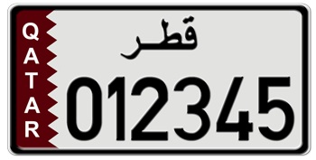
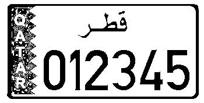
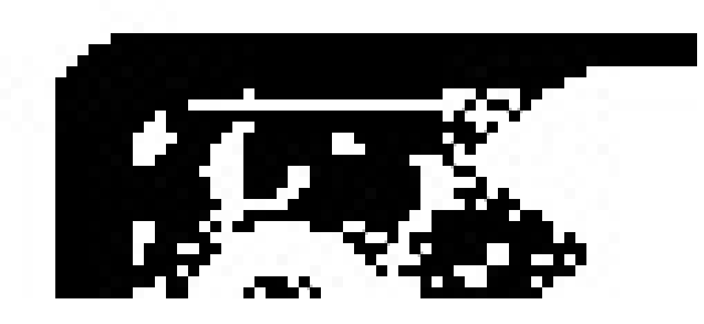
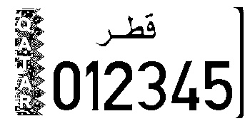
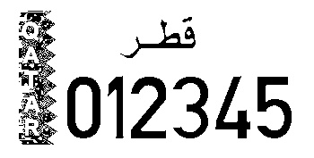
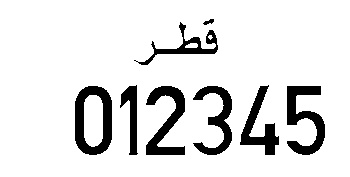
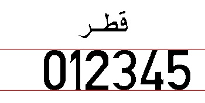
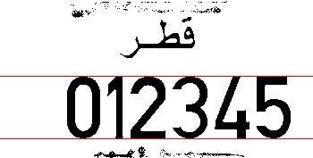
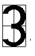

# License Plate Recognizer | OpenCV

### An image processing algorithm to extract license number from license plate images using statistical analysis.

##### Abstract

As traffic accidents increase due to over speeding and other traffic violations, it becomes important for law enforcement agencies to find technological solutions to detect these violations. In many countries, the government has placed high resolution cameras on various roads and highways that detect speeding motorists and take a picture of their vehicles. These images are then processed to detect the license plate numbers and issue tickets accordingly.

My task, in this repo, is to take an image of a license plate and programmatically (by writing a computer program) determine the license plate number.

This repo needs the ImageWriter Library that uses 'OpenCV' [the library can be found in the files]. 
[Here are some sample images of license plate](samples.zip)

##### Subtask 00 | Normalization
Before we can start processing a license plate, it is important for us to reduce the number of colors in the image. This process of color reduction is called normalization and we can do this by converting the image to black and white. This process helps us reduce the amount of information that we have to process. So the first step is to convert this colored image to a black and white image. We take each pixel of the image and if the average proportion of all three values: R, G and B is less than some arbitary value (e.g., 85 or 100), we set the colors to 0 otherwise we set each component to 255.

The following function is used to convert a picture to black and white:
```
def convertBlackWhite(pic):
   rows = ImageWriter.getHeight(pic)
   columns = ImageWriter.getWidth(pic)
   for i in range(0,rows):
      for j in range(0,columns):
      c = ImageWriter.getColor(pic,j,i)
      if sum(c)//3 >= 100: # may be some other value than 100; depends on the quality of sample images
         ImageWriter.setColor(pic,j,i,[255,255,255])
      else:
         ImageWriter.setColor(pic,j,i,[0,0,0]
```
Here is an image of a Qatari license plate without any processing



After converting the image to Black&White, it should look similar to the following image



##### Subtask 01 | Remove Border

The first thing we need to do with the black&white license plate is to remove the border around it. This allows us to reduce the amount of information that we will have to process. To remove the border, we start from the left side of the image. We observe that the left border is made up of contiguous black pixels and the first white pixel indicates the end of the border. This is a trivial observation but nonetheless important for our purposes. We take the image and start at the left most part of each row. Start by looking for the first black pixel.

Consider the following picture (zoomed in) of the top-left corner of a license plate:



We start from the top row of the image and iterate horizontally through each column of this row and wait for the first black pixel. When we see the first black pixel, we set its value to white and after that every black pixel is changed to white until a white pixel is encountered. This white pixel would indicate the end of border. If we continue this process for the entire image, our results looks like the following:



Notice that we still have the border on the right side leftover. This is because in the previous step, we started looking at the black pixel from left corner which ignored those black pixels that are on the right side. To remove this bit of pattern, we use a similar technique but start from the right side. So start looking at the pixels from the right most edge of the image and iterate backwards. The first contiguous set of black pixels should be converted to white. This results in the following:



`removeBorder(pic)` is the function that takes a picture as input and removes the border from the picture. The function does not return anything.

##### Subtask 02 | Remove Text on the Left

We notice in the last image of the previous section that we have some text on the left side that says Qatar. This needs to be removed for us to be able to locate the numbers on the license plate. Removing this text is similar to removing the border and we approach it in two steps: In the first step, we find out the location of the start and end of this blob of text. We use the following algorithm to do that:
```
# Find a vertical blob between
# startRow and endRow Starting at inital Column initColumn
   x := initColumn
   hasBlack := False
   while x is less than the width of the image
       and hasBlack is False Repeat the following:
          go through each row from startRow to endRow
            If the current pixel is Black then this row
            has at least one black pixel,
               set hasBlack to True

         go to the next column by incrementing x by 1
   #The previous column had a black pixel so save that location
   startX := x-1
   #now we look for a column that is all white
   allWhite := False
   #go through all the rows again for each column
   while x is less than the width of the image and allWhite is False
     #assume that this is an all white line
     allWhite := True
     go through all the rows from startRow to endRow
     if the current color is black then this is not an all white column
           allWhite := False
     go on to the next column by incrementing x by 1

 # At this point,
 # the previous column was an all white column
 # indicating the end of the text blob.
 endX := x-1

 # At this point startX is the start of column of the blob
 # and endX is the end column of the blob.
```

Once we have found the start and end of the text, we need to set all the pixels there to White. We do that by calling a function that does that.
`findVerticalBlob(pic,startRow, endRow, startColumn)` is the function returns startX and endX as a list as defined in the algorithm above.
`removeColor(pic, startx, starty, endx, endy)` is the function that will set all pixels from rows starty to endy and columns startx to endx to white.

Calling the functions in the following order should clear out the text on the left as shown in the following figure.
```
columns = findVerticalBlob(pic,0,ImageWriter.getHeight(pic),0)
removeColor(pic, columns[0],0,columns[1],ImageWriter.getHeight(pic))
```


##### Subtask 03 | Horizontal Segmentation

Horizontal segmentation is the first main phase of locating the numerical characters on the license plate after all the surrounding noise has been reduced. First we will try to detect the starting row and ending row of the digits and hence the name horizontal segmentation. This involves writing an algorithm that will determine the location of imaginary red lines “start” and “end” shown here (note: the red lines are for illustration only):



This task is accomplished by treating any series of horizontal lines that have any black pixel as a “blob”. So, so let's start by looking at the following figure:


If we start at the top of the image, there are a few horizontal lines that are all white. Then there is some text which is made up of a group of lines where each line has some black in it. This is followed by another small group of white lines and then some text and then a few empty rows. So in all we have two blobs on the image. If there is some noise in the image, then we might get more than three blobs. For example, consider the following figure:



The image in this figure will result in 4 blobs. One extra blob because of thin line at the top and one because of the line at the bottom.
Our goal is to find the biggest blob. The following algorithm outlines our methodology for finding the biggest horizontal blob.
```
#initialize variables
inBlob := False
startOfBlob := 0
maxBlob := 0
result := Empty List
Loop through all rows of the image
   For this row, go through each column and
   check if there are any black pixels in this row
   If black pixels found and inBlob is False
      # This is start of a blob
     Set isBlob to True
     # save the start of blob
     Set startOfBlob to current row
  If no black pixels and inBlob is True
     Set inBlob to False
     Find size of the blob we just finished
     If size is bigger than biggest blob we have seen
        result = [startOfBlob,current row]
        maxBlob  = size of this blob
End Loop
```

`horizontalSegmentation(pic)` is the function that takes an image that does not have any borders as input argument. This function should determine the position of the numbers on the license plate and send the top and bottom of the area of license plate that holds the numbers. This information should be returned as a list of the format [top, bottom]

##### Subtask 04 | Vertical Segmentation

Once we have the numerical segments located, we will do the rest of the work with only this segment. Our task now is to figure out the location (start and end) of each of the digits in this vertical blob. For vertical segmentation, we start from the left most column of the image and step through each column. For each column we analyze each pixel in this column. In the beginning we will find that all pixels are white. As soon as we hit the first digit, the color will change to black. The first time we collect a black pixel we mark it the start of the digit and then keep on searching until we see a column that is all white. This would mark the end of this digit. We repeat this step six times, each time starting from the end of the last digit in order to search for the next digit. The function we wrote earlier, `findVerticalBlob` can do this task as long as we pass in the correct values of startRow, endRow, startColumn. In this case, startRow and endRow will be the limits we obtained from the `horizontalSegmentation` function and startColumn should be the end of the previous digit.

##### Subtask 05 | Decoding a Digit
Now that we have isolated each digit, recognizing each digit is a simple feature extraction and statistical analysis task. Feature extraction is just a fancy name for a simple process described below. Let’s take digit three as an example, we take this digit and divide it in four quadrants as shown:



Now we calculate the percentage of black pixels in each quadrant of the digit. Percentage of black is taken by counting all black pixels in a quadrant and dividing it by the total number of pixels in the quadrant. We do this step for each of the four quadrants. Once we have these values for each quadrant, we compare with the measured value for each digit as shown in the table below. The values that match most closely is our prediction for this digit. Remember that just like in math, the top right quadrant is the first quadrant, the top left is the quadrant 2, and the rest follow counter clock-wise.

| Digit | Q1 |	Q2	| Q3	| Q4 |
| --- | --- | --- | --- | ---|
| 0   | 0.49	| 0.51	| 0.52	| 0.48 |
| 1	| 0.72	| 0.34	| 0.005	| 0.69 |
| 2   | 0.54	| 0.30	| 0.51	| 0.34 |
| 3   | 0.50	| 0.24	| 0.22	| 0.47 |
| 4	| 0.16	| 0.28	| 0.41	| 0.52 |
| 5	| 0.35	| 0.69	| 0.32	| 0.46 |
| 6	| 0.41	| 0.64	| 0.54	| 0.52 |
| 7	| 0.59	| 0.32	| 0.37	| 0.08 |
| 8	| 0.54	| 0.54	| 0.51	| 0.51 |
| 9	| 0.53	| 0.54	| 0.39	| 0.62 |

We use statistical analysis for pixel matching. This is again a fancy word for the following algorithm. The table shows measured values for percentage of black pixels in each quadrant of each digit. For example, the fourth row in the table shows the percentages for digit 3. As can be seen from the figure of digit three above, and the table, there is a high number of black pixels in Quadrant 1, and the corresponding percentage is 50% in the table. Quadrant 3 has fewer black pixels and the corresponding percentage in Table 1 is 22%.

Also notice that several quadrants have very similar percentages for different digits. For example, in Quadrant 1, the percentage of digit 0 and 8 are very similar. Hence we have to use the knowledge of all four quadrants to determine the digits. We use the following statistical method: Let’s say we have a digit that we are trying to decode. We take this digit’s Q1 value, and subtract it from Q1 value for each digit. This shows us how close the two values are. If the difference is small, then the value are similar otherwise they are different. We divide this difference by 4 since we have four quadrants. We repeat this step for all four quadrants and add the results for each digit. The digit with the minimum overall difference most closely matches the sample digits and is our estimation for this digit.

Let's work an example. Assume that for a given digit, our values for Q1, Q2, Q3, and Q4 are 0.12, 0.28, 0.42, 0.54. Then for Digit 0, the absolute difference between corresponding quadrants is 0.37, 0.23, 0.1, 0.06, with a total difference equal to 0.37/4 + 0.23/4 + 0.1/4 + 0.06/4 = 0.19. Similarly, for Digit 4 we get values 0.04, 0.00, 0.01, 0.02 with an overall difference of 0.0175. When we get these overall difference values for all 10 digits, we can search for the smallest difference and that is our estimate for this particular digit.

`decodeCharacter(pic, startrow, endrow, startcol, endcol)` is the function that will take a pic as input parameter and decode the number bounded the rectangle represented by startrow, endrow, startcol, and endcol.

##### Subtask 06 | Putting it all together
`decodeLicensePlate(filename)` is the function that will take a filename of a license plate image as input. The function should then load the image represented by filename and should return a string that represents the number on the license plate.

The decode license plate function should follow these steps:

1. Load the image
2. Convert the image to black and white
3. Remove the border
4. Remove the text blob on the left side
5. horizontal segmentation
6. vertical segmentation
7. Decode each character from horizontal and vertical segmentation and build a list
